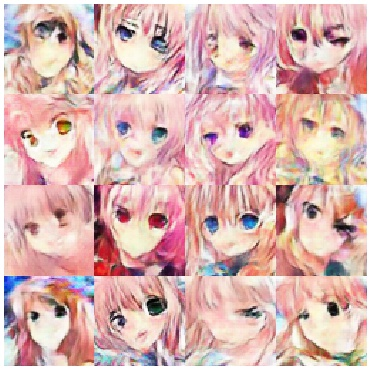
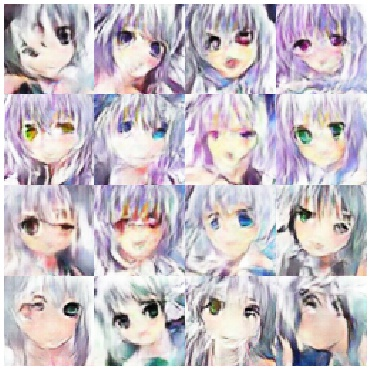
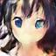
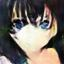
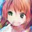
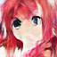
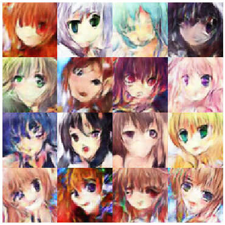

# Anime-Face-ACGAN
## Info
An ACGAN to generate anime faces with specific hair and eyes color.

Range of colors

| Hair |  Eyes  |
|------| -------|  
|orange|  gray  |
|white |  black |
|aqua  |  orange|
|gray  |  pink  |
|green |  yellow|
|red   |  aqua  |
|purple|  purple|
|pink  |  green |
|blue  |  brown |
|black |  red   |
|brown |  blue  |
|blonde|        |


## Dataset
Special thanks for 樊恩宇, TA of MLDS providing data. Data and tags are originally from konachan.

The tags(hair or eyes color) of each image can be [tags_clean.csv](tags_clean.csv)


## Usage
ACGAN_train.py

```
usage: ACGAN_train.py [-h] --uid UID [--train_path TRAIN_PATH]
                      [--gen_lr GEN_LR] [--dis_lr DIS_LR]
                      [--batch_size BATCH_SIZE] [--epochs EPOCHS]
                      [--latent LATENT]

Anime ACGAN

optional arguments:
  -h, --help            show this help message and exit
  --uid UID             training uid
  --train_path TRAIN_PATH
                        training data path
  --gen_lr GEN_LR       learning rate of generator
  --dis_lr DIS_LR       learning rate of discriminator
  --batch_size BATCH_SIZE
                        batch size for training
  --epochs EPOCHS       epochs for training
  --latent LATENT       latent size
```

generate.py

```
python generate.py [sample.txt]
```

This will generate images with the condition given in `sample.txt`. The format can be found at  [sample.txt](pretrained_models/sample.txt)

## Images

### GIF


### Generated with given condition
#### Pink hair /w different eyes color


#### White hair /w different eyes color


#### Black hair Blue eyes



#### Red hair Green eyes



#### Random


## Credits
Model and training is inspired by 
[pavitrakumar78/Anime-Face-GAN-Keras](https://github.com/pavitrakumar78/Anime-Face-GAN-Keras)


